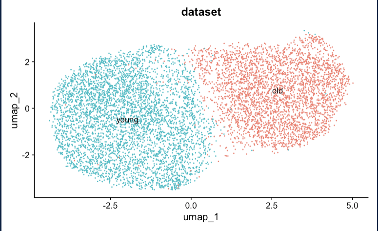

# HSC scRNA-ATAC-seq Analysis

## Overview
This repository contains the analysis and results of a single-cell multi-omics study combining **scRNA-seq** and **ATAC-seq** data to investigate **hematopoietic stem cells (HSCs)** across different age groups. The analysis focuses on the transcriptional and chromatin accessibility landscapes in **young and aged HSCs**, with a particular emphasis on age-related changes in chromatin accessibility and stress response pathways.

## Project Structure
```
single_cell/
├── README.md                 # Main project documentation
├── scripts/                  # Analysis scripts
├── data/                     # Raw and processed data
├── plots/                    # Generated visualizations
├── output/                   # Analysis outputs
├── results/                  # Processed results
├── reports/                  # Generated reports
└── docs/                     # Documentation
```

For detailed project structure, see [PROJECT_STRUCTURE.md](PROJECT_STRUCTURE.md).

## Quick Start
1. Clone this repository
2. Install required R packages:
   ```R
   install.packages('BiocManager')
   BiocManager::install(c("Signac", "Seurat", "EnsDb.Mmusculus.v79"))
   ```
3. Download data from GEO (GSE190424)
4. Run the analysis pipeline:
   ```R
   rmarkdown::render("scripts/HSC_scRNA-ATAC_seq.Rmd")
   ```

## Data Source
The data used for this analysis is publicly available on **GEO** under the accession [GSE190424](https://www.ncbi.nlm.nih.gov/geo/query/acc.cgi?acc=GSE190424). The study provides high-resolution single-cell datasets, allowing detailed insights into HSC biology.

### Original Research
This work is a reproduction of the research presented in the paper:  
**"Epigenetic traits inscribed in chromatin accessibility in aged hematopoietic stem cells"** by Itokawa et al., published in *Nature Communications* (2022).  
[DOI: 10.1038/s41467-022-30374-9](https://doi.org/10.1038/s41467-022-30374-9) | [PMID: 35577813](https://pubmed.ncbi.nlm.nih.gov/35577813/)

## Analysis Overview

### Objectives
1. Compare gene expression profiles between **young and aged HSCs**
2. Identify **chromatin accessibility differences** linked to aging
3. Integrate **scRNA-seq** and **ATAC-seq** datasets to understand age-related changes in gene regulation and stress responses

### Key Findings
- **Chromatin Accessibility Changes**: Aged HSCs exhibit alterations in chromatin accessibility, particularly in regions enriched for **STAT, ATF, and CNC family transcription factor motifs**
- **Stress Response Pathways**: Open differentially accessible regions (open DARs) in aged HSCs are linked to **augmented transcriptional responses** under stress conditions
- **Enhancer States**: Most open DARs comprise **active, primed, and inactive enhancers**, suggesting a role in regulating stress-induced gene expression

## Analysis Pipeline

### 1. Data Preprocessing
- **scRNA-seq Data**: 
  - Quality control filtering
  - Normalization
  - Feature selection
- **ATAC-seq Data**: 
  - Peak calling
  - Fragment file processing
  - Quality metrics calculation

### 2. Quality Control
- Cell filtering based on:
  - Peak region fragments (3000-20000)
  - Percentage of reads in peaks (>15%)
  - Blacklist ratio (<0.05)
  - Nucleosome signal (<4)
  - TSS enrichment (>2)

### 3. Analysis Steps
1. **Dimensionality Reduction**
   - PCA
   - UMAP
   - t-SNE

2. **Clustering**
   - Graph-based clustering
   - Cluster marker identification

3. **Differential Analysis**
   - Gene expression differences
   - Chromatin accessibility changes
   - Motif enrichment analysis

4. **Integration**
   - RNA-ATAC data integration
   - Correlation analysis
   - Regulatory network inference

## Results

### 1. UMAP Clustering Analysis

*UMAP visualization showing distinct clustering patterns between young and aged HSCs. The analysis reveals clear separation between different cell populations, indicating distinct chromatin states and transcriptional profiles.*

### 2. Gene Expression Analysis

*Feature plot showing expression patterns of key genes across different cell clusters. This visualization helps identify genes that are differentially expressed between young and aged HSCs.*

### 3. Expression Level Distribution

*Violin plot showing the distribution of expression levels for key genes. This analysis reveals how gene expression varies between young and aged HSC populations.*

### 4. Chromatin Accessibility Profiles

*Coverage plot showing chromatin accessibility profiles around differentially accessible regions. This visualization demonstrates how chromatin accessibility changes with age in specific genomic regions.*

### 5. Transcriptional Profiles
- Aged HSCs exhibited altered expression of genes associated with:
  - Stemness (e.g., GATA2, RUNX1)
  - Differentiation
  - Stress response

### 6. Chromatin Accessibility
- Aged HSCs displayed:
  - Reduced accessibility in promoter and enhancer regions
  - Open DARs enriched for specific transcription factor motifs
  - Altered regulatory landscape

### 7. Integrated Analysis
- Strong correlation between chromatin accessibility and gene expression
- Enhanced transcriptional responses under stress conditions
- Regulatory network changes in aged HSCs

## Technical Details

### Prerequisites
- R (version 4.0 or higher)
- Required R packages:
  - Seurat (for scRNA-seq analysis)
  - Signac (for ATAC-seq analysis)
  - EnsDb.Mmusculus.v79 (for genome annotation)
  - Additional packages: tidyverse, ggplot2

### Data Requirements
- ATAC-seq peak count matrix (.h5)
- Cell metadata (.csv)
- Fragment files (.tsv.gz)
- Genome annotation (mm10)

### Output Files
- Processed data objects
- Quality control plots
- Differential analysis results
- Integration analysis results
- Visualization plots

## Troubleshooting

### Common Issues
1. **Memory Issues**
   - Solution: Increase R memory limit
   - Command: `memory.limit(size = 16000)`

2. **Package Installation**
   - Solution: Install BiocManager first
   - Command: `install.packages('BiocManager')`

3. **Data Loading**
   - Solution: Check file paths and formats
   - Ensure all required files are present

### Performance Tips
- Use parallel processing for large datasets
- Implement chunked processing for memory efficiency
- Save intermediate results

## Citations
If you use this repository or the reproduced analysis in your work, please cite:
```
Itokawa N, Oshima M, Koide S, Takayama N et al. Epigenetic traits inscribed in chromatin accessibility in aged hematopoietic stem cells. Nat Commun 2022 May 16;13(1):2691. PMID: 35577813
```

## License
This project is licensed under the **MIT License**. See [docs/LICENSE](docs/LICENSE) for details.

## Contact
For questions or issues, please open an issue in this repository.

## Acknowledgments
- Original paper authors for providing the dataset
- Seurat and Signac development teams
- R/Bioconductor community 

